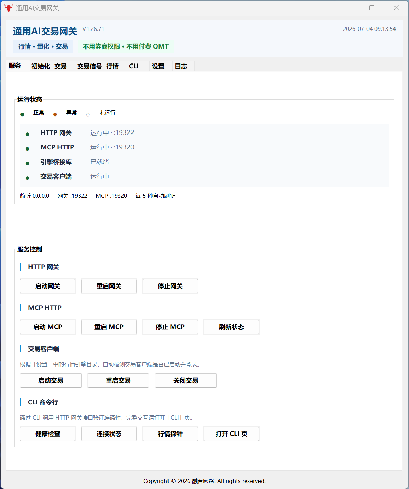
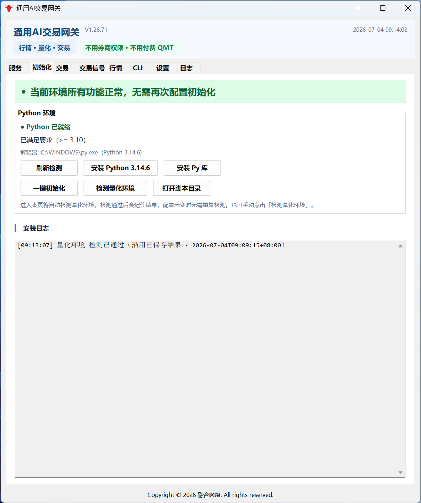
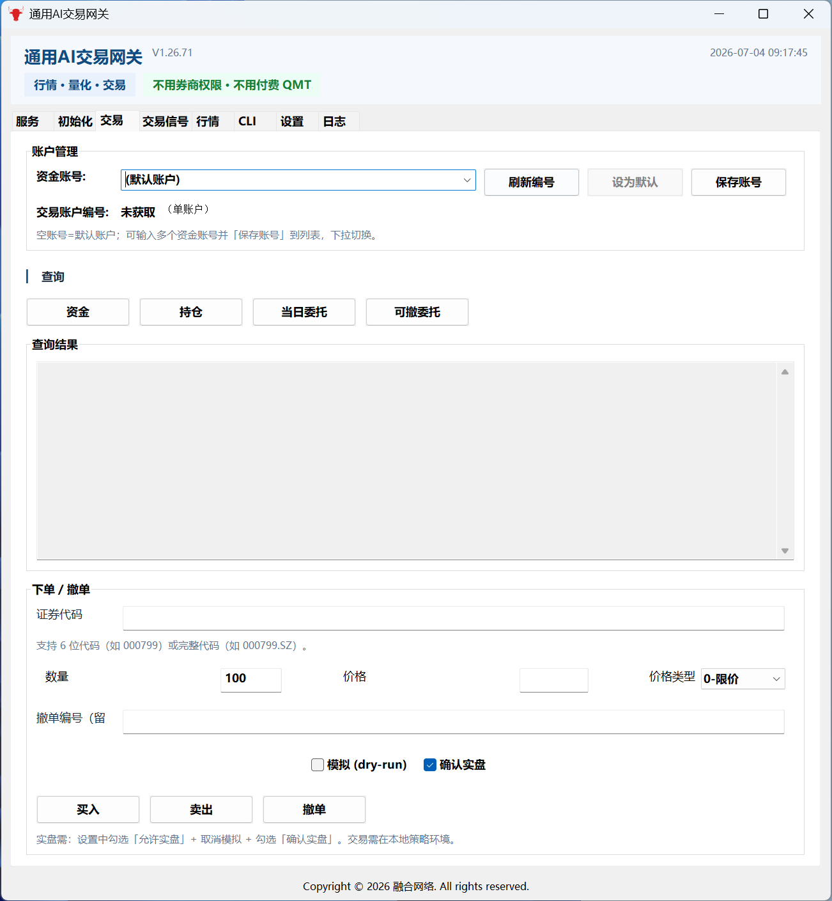
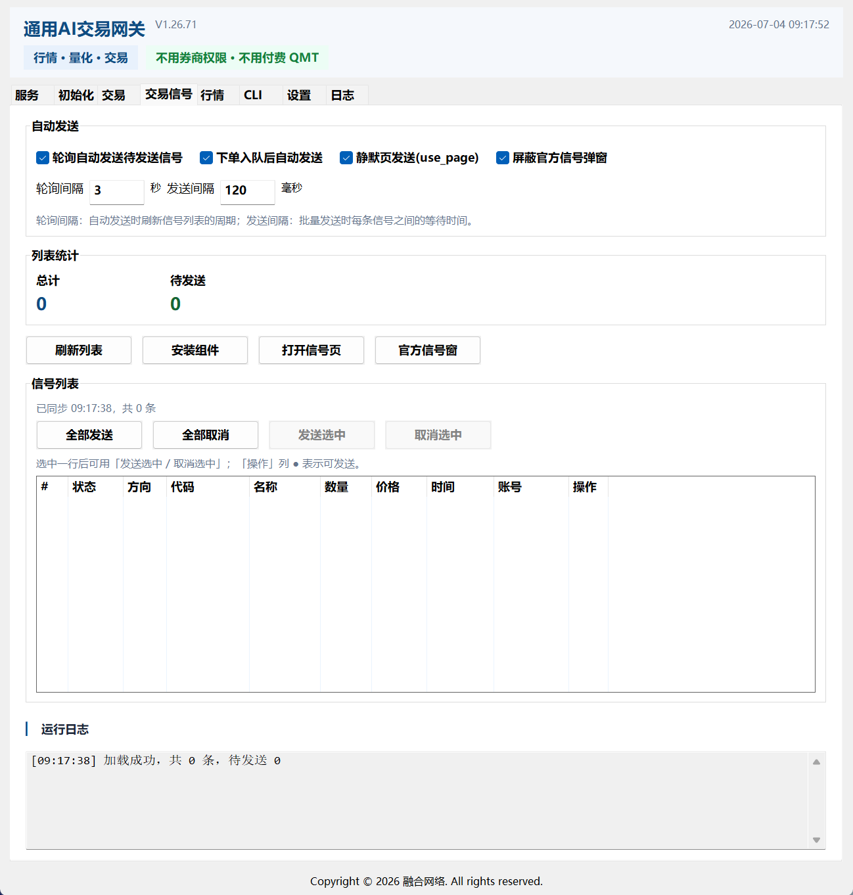
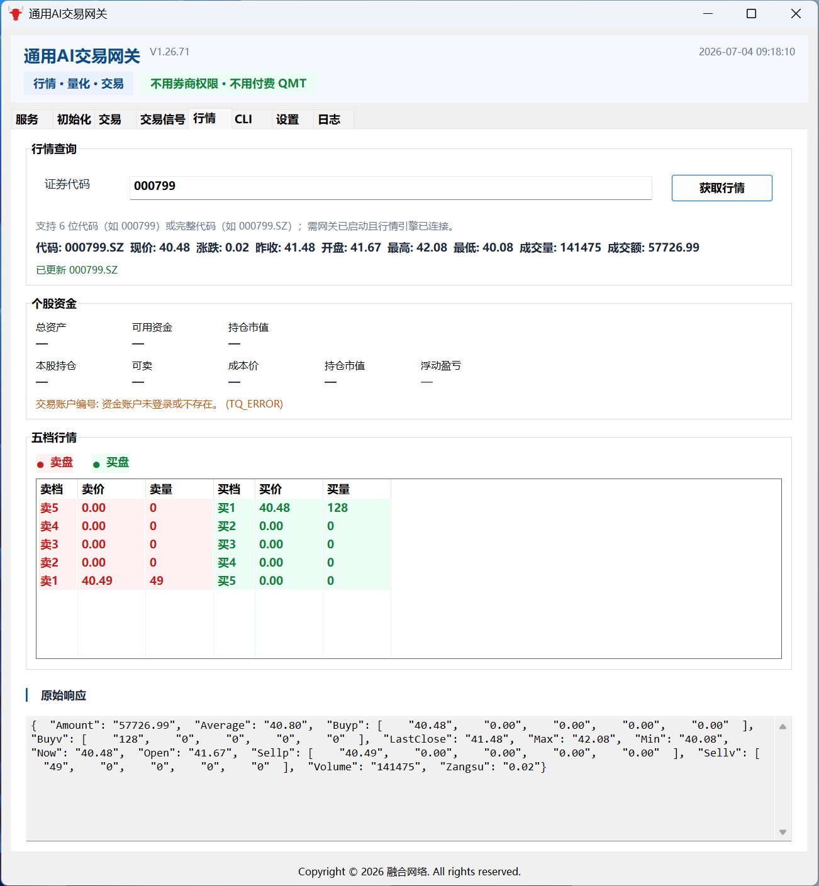
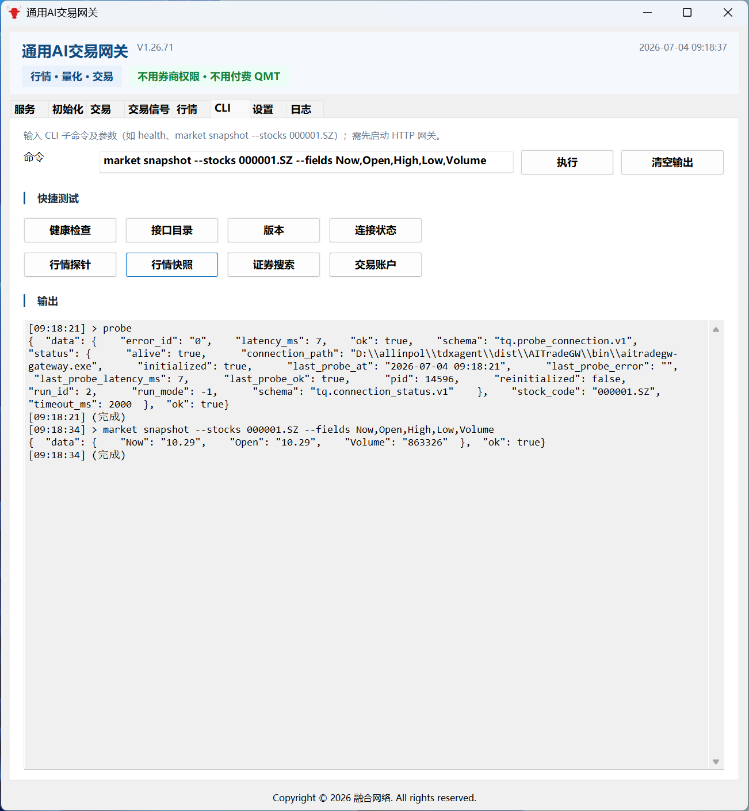

# 通用 AI 交易网关

> **让 AI 直接连上 A 股行情与交易——不用券商权限，不用付费 QMT。**

## 痛点 · 卖点

**策略写好了，卡在最后一步下单？** 很多人已经有选股逻辑、回测结果，甚至 AI 已经能给出买卖建议——真正缺的是一条 **稳定、可编程的交易接口**。向券商申请 QMT、购买第三方量化接口，往往 **流程长、费用高**，个人开发者和小团队很难迈过这道坎。

**通用 AI 交易网关** 就是补上量化链路里最关键的一环：**查行情 → 出信号 → 真正下单**。本地对接通用行情引擎，安装配置后即可通过图形界面、HTTP 或 MCP 完成查询与报单，**不用额外向券商申请权限，不用为 QMT 或按次计费接口持续付费**。

**不是 PyGUI，不是模拟键鼠点屏幕。** 我们走的是行情软件 **标准 API 原生调用**——与官方量化环境同源，数据与客户端一致，**毫秒级响应、不依赖窗口坐标**，分辨率或皮肤变化也不会把自动化搞崩。稳定、高效，才是能长期跑的策略基础设施。

**行情 · 量化 · 交易** 一条链路打通。图形界面开箱即用，Cursor / Codex 等 AI 工具通过 MCP 一键接入。Windows 本地安装，**对接通用行情引擎**，个人即可上手。

## 说人话

只要你当前能在行情软件上可以正常交易的账户（含模拟），不用开通任何权限，本交易网关安装即用，无需任何特殊设置。

**出品：融合网络**

  

图形控制台 · 服务一键启停 · 状态一目了然

---

## 联系作者（优先微信）

安装 **AITradeGW**、行情引擎目录配置、交易信号组件、MCP/局域网连不上、标准版/高级版激活等问题，**请优先联系作者**，微信通常比自行排查更快。

| 项目 | 内容 |
|------|------|
| **联系人** | 李先生 |
| **手机** | [18670334431](tel:18670334431) |
| **微信** | 同上号码（**推荐**：添加时请备注「AITradeGW」+ 简要问题） |

  

李先生微信二维码（长按或扫码添加）

> 另有 **同花顺专用版（RHTHS）** 用户也可咨询同一联系方式，备注「RHTHS」即可。交易与资金风险由用户自行承担；技术咨询仅限产品安装、配置与授权，不提供代客理财或投资建议。

---

## 为什么选择它

| 痛点 | 通用 AI 交易网关 |
|------|----------------|
| QMT 要申请、要付费 | **不用向券商申请权限，不用付费开通 QMT** |
| 环境折腾半天 | **Windows 安装包，图形界面点一点就能用** |
| AI 只能聊天不能查仓 | **MCP 直连，Cursor / Codex / Agent 实时查行情、持仓** |
| 策略下单还要手动点信号 | **交易信号自动同步、静默发送** |
| 盘后数据要天天手动下 | **计划任务定时拉日线/财务包，未更新则跳过** |
| AI 不会自己更新本地数据 | **MCP / HTTP 可让 AI 查更新时间、触发下载** |
| 担心误下单 | **默认模拟盘，实盘需双重确认** |

---

## 核心能力

### 行情全覆盖

K 线、实时快照、五档、板块、财务、公式——本地行情引擎能提供的，网关都能调。

### 交易全链路

查资金、查持仓、查委托、买卖撤；图形界面点选下单，AI 通过接口查询。

### 交易信号

策略交易信号列表同步、一键发送、下单后自动跟发——入队后不再反复手点确认。

### 盘后数据 · 计划任务（新）

通达信 **日线 / 财务 / 股票** 汇总包（官网固定 ZIP）可一键下载到设置页「安装目录」下的 `vipdoc`，也可 **交易日定时自动更新**：

| 能力 | 说明 |
|------|------|
| **立即下载** | 图形「计划任务」页：下载日线、下载财务；远端未变则跳过，避免重复解压 |
| **定时任务** | 默认盘后时段（如 16:10 / 16:20），仅 **A 股交易日** 触发；需保持「服务」页网关常驻 |
| **防重复** | 比对远端 `Last-Modified`，已与本地 stamp 一致则跳过 |
| **AI 可调** | MCP：`tdx_vipdoc_status` / `tdx_vipdoc_download` / `tdx_schedule_*`；CLI：`aitradegw schedule …`；HTTP：`/v1/schedule/*` |

数据源示例：`hsjday.zip`（日线）→ `vipdoc`；`tdxfin.zip`（财务）→ `vipdoc/cw`。详见控制台 **计划任务** 页与下方 [CLI 使用说明](./CLI使用说明.md)。

### AI 友好

专为 **Cursor、Codex、OpenClaw、WorkBuddy、各类 Agent** 设计。配置 MCP 后，AI 帮你盯盘、查仓、读行情，也可 **查盘后数据是否最新、触发更新、管理计划任务**。

### 图形控制台

服务启停、初始化检测、交易、信号、行情、**计划任务**、AI 连接器、在线激活——日常操作一个窗口搞定。

---

## 界面一览

| 服务 | 初始化 |
|:---:|:---:|
|  |  |
| 网关与 MCP 一键启停 | 量化环境一键检测 |

| 交易 | 交易信号 |
|:---:|:---:|
|  |  |
| 资金、持仓、买卖撤 | 信号列表与自动发送 |

| 行情 | 命令行探针 |
|:---:|:---:|
|  |  |
| 快照、五档、个股查询 | 内置快捷测试 |

另有 **计划任务**（盘后日线/财务下载与定时）、**AI 连接器**（如 WorkBuddy）等页面。各页说明见 [图形控制台使用指南](./GUI.md)。

---

## 三步上手

1. **安装** — 运行 `AITradeGW_Setup_*.exe`，选择 **行情引擎目录** → [安装指南](./USER-INSTALL.md)
2. **启动** — 打开图形控制台 → **设置** 确认目录 → **服务** 页 **启动网关**
3. **使用** — 在 **交易** / **行情** 页操作；或按 [AI 接入指南](./CURSOR.md) 连接 Cursor / Codex

**盘后数据（可选）**：到 **计划任务** 页点「下载日线 / 下载财务」，或启用默认定时；AI 也可说「查一下盘后数据更新时间」/「更新日线数据」。

需要高级功能？**激活** 页输入注册码在线激活 → [授权说明](./LICENSE.md)

---

## 适合谁

- 个人量化入门，想少折腾环境、快速跑通「行情 → 策略 → 交易」
- 用 Cursor / Codex / AI Agent 玩 A 股，需要真实行情与持仓数据
- 希望 **图形界面 + AI** 双通道并用的 Windows 用户
- 轻量自动化：查仓、发信号、**盘后数据定时更新**、脚本 / 计划任务调用，一个网关全包

---

## 同系列产品

融合网络另提供 **同花顺 PC 专用版** [RHTHS / THS_MCP_Quant](https://github.com/miaolink/THS_MCP_Quant) — 同样支持 MCP + 图形控制台 + AI 接入，**无需外部 API 授权**。

| | **通用 AI 交易网关**（本项目） | **RHTHS**（同花顺专用） |
|---|---------------------------|----------------------|
| 定位 | 通用型 · 对接本地行情引擎 | 同花顺 PC 深度适配 |
| 核心卖点 | 不用 QMT · 不用券商权限 | 不用外部 API · 原生接口 |
| 详情 | [本文档](./README.md) · [在线站](https://www.miaolink.cn/AITradeGW/index.php) | [GitHub](https://github.com/miaolink/THS_MCP_Quant) · [在线文档](https://www.miaolink.cn/rhths/index.php) |

两套产品 **注册码体系共用**，备注「AITradeGW」或「RHTHS」均可联系获取。

---

## 文档目录

| 文档 | 说明 |
|------|------|
| [软件功能图.md](./软件功能图.md) | 能力一览 · 适合快速了解产品 |
| [USER-INSTALL.md](./USER-INSTALL.md) | 安装、升级、卸载 |
| [GUI.md](./GUI.md) | 图形控制台各页面怎么用 |
| [CURSOR.md](./CURSOR.md) | 让 Cursor / Codex / AI 接入网关 |
| [WorkBuddy安装MCP交易网关.md](./WorkBuddy安装MCP交易网关.md) | **机读任务**：检测本机网关并给 WorkBuddy 配置 MCP |
| [WorkBuddy设计与测试MCP交易网关skill说明.md](./WorkBuddy设计与测试MCP交易网关skill说明.md) | **机读任务**：设计 Skill + 系统规则，股票相关强制走 MCP |
| [WorkBuddy调优参考.md](./WorkBuddy调优参考.md) | **机读参考**：本机强定制抽象（人格/MCP/Skill/输出合约，已脱敏） |
| [CLI使用说明.md](./CLI使用说明.md) | 本机命令行 `aitradegw.exe` |
| [AI交易示例.md](./AI交易示例.md) | Cursor / Codex 对话示例与 MCP 工具速查 |
| [LICENSE.md](./LICENSE.md) | 注册码与在线激活 |
| [DISCLAIMER.md](./DISCLAIMER.md) | 免责声明 |

---

## 更多链接

- **在线文档**：[www.miaolink.cn/AITradeGW](https://www.miaolink.cn/AITradeGW/index.php)
- **同花顺专用版**：[github.com/miaolink/THS_MCP_Quant](https://github.com/miaolink/THS_MCP_Quant)
- **本项目**：[github.com/miaolink/AITradeGW](https://github.com/miaolink/AITradeGW)

---

**投资有风险，入市需谨慎。本软件为技术工具，不构成任何投资建议。**

**Copyright © 2026 融合网络. All rights reserved.**
